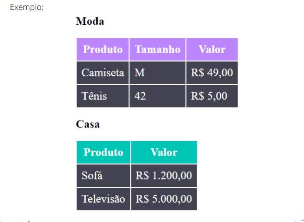

# Desafio HTML + CSS Básico ⭐
## Desafio 4 / Tabela Estilizada

- Faça uma tabela de roupas com tamanho e valor da peça descrito em cada
linha.
- Não esqueça de adicionar um cabeçalho em cada coluna.
- Cor de fundo do cabeçalho moda - #BB86FC
- Cor de fundo do cabeçalho casa - #00C4B4
- Cor de fundo dos valores da tabela - #424250
- Regra: não estilize usando as tags HTML, crie classes para estilizar sua tabela.
EX: .produtos-casa th { … }

## Tecnologias utilizadas

  
  

